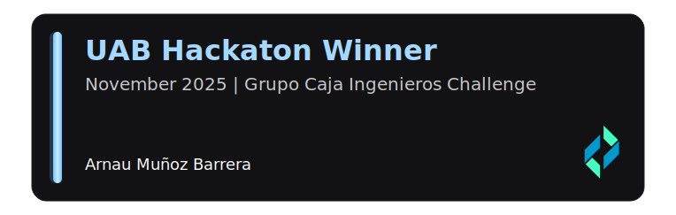

<h1 align="center"><b>Hey, I'm Arnau Muñoz </b></h1>

 

I am a computer engineering student, currently halfway through my degree. I am expanding my knowledge in back-end development. Dedicated to crafting efficient and elegant solutions across the systems. Constantly seeking new challenges and opportunities to expand my skills and show my knowledge!
- 🎯 Keep improving & enjoy programming.
- 👯 I’m looking forward to collaborate on open source projects.
- 📫 Connect with me! <a href="arnaumunozbarrera@gmail.com">arnaumunozbarrera@gmail.com</a>
 
<strong> Checkout my personal Website at: <a href="https://arnaumb-dev.netlify.app/"> Arnau's Portfolio</a>!</strong>

## <b> Job Experience </b>
<h4> Frontend </h4>
 
  
  

<h4> Backend </h4>

  
  

<h4> Databases  |  Auth  |  Tools </h4>

  
  
  

  

  
  
  
  
  
  
  

## <b> Skills </b>

<h4> Languages </h4>
 
  
  
  
  

<h4> Databases </h4>

  
  
  

<h4> Tools </h4>

  
  
  

## <b> Github Stats </b>

## <b> Lifetime Stats </b>

  
  

## 

